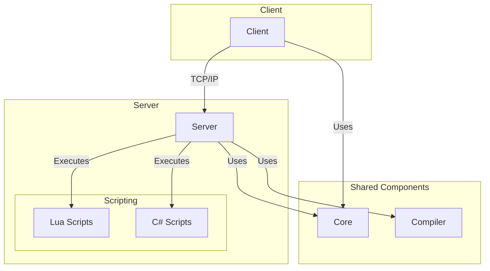

# Architecture

The BYOND 2.0 project is a game engine with a client-server architecture, built on .NET 10.0 using C# for the core and Lua/C# for scripting.

## Project Structure

The project is divided into several key components:

*   **Core:** A class library containing the main logic and common components used by both the server and the client. This includes game logic, state management, and the scripting engine.
*   **Server:** A console application that runs the game server. It is responsible for managing the game world, handling client connections, and executing scripts.
*   **Client:** A console application that is the game client. It is responsible for rendering the game world, handling user input, and interacting with the server.
*   **Editor:** A graphical application for editing game maps and other resources.
*   **Compiler:** The OpenDream compiler, integrated as a project, which compiles DM scripts into a format the engine can understand.
*   **scripts:** A directory containing Lua and C# scripts that define the game logic.
*   **tests:** A project with unit tests to verify the correct operation of the project components.

## Architecture Diagram

