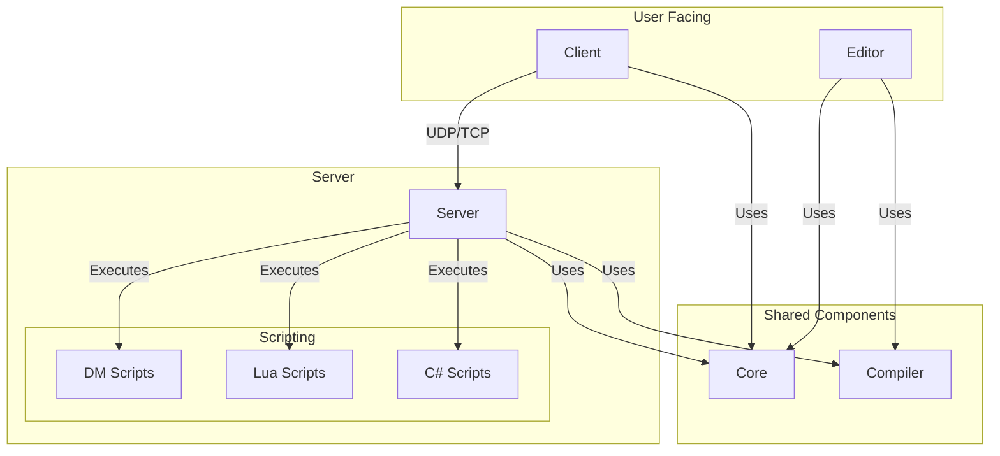

# Architecture

The BYOND 2.0 project is a game engine with a client-server architecture, built on .NET 8.0 using C# for the core.

## Scripting

The engine primarily uses **Dream Maker (DM)**, the language used by BYOND, for defining game logic. The integrated OpenDream compiler compiles DM code into an intermediate format that the server's virtual machine can execute.

Additionally, **Lua** and **C#** are supported for more specialized scripting tasks, performance-critical code, or for developers more comfortable with those languages.

## Project Structure

The project is divided into several key components:

*   **Core:** A class library containing the main logic and common components used by the server, client, and editor. This includes game state management, the object model, and the scripting engine interfaces.
*   **Server:** A console application that runs the game server. It uses a custom UDP implementation for real-time game communication and the Kestrel web server for serving assets via HTTP. It is responsible for managing the game world, handling client connections, and executing scripts.
*   **Client:** A basic console application that serves as the game client. It handles user input and communicates with the server.
*   **Editor:** A graphical application built with Silk.NET and ImGui for creating and editing game maps, objects, and other resources.
*   **Compiler:** The OpenDream compiler, integrated as a project, which compiles DM scripts into a format the engine can understand.
*   **scripts:** A directory containing DM, Lua, and C# scripts that define the game logic.
*   **tests:** A project with unit tests to verify the correct operation of the project components.

## Architecture Diagram

