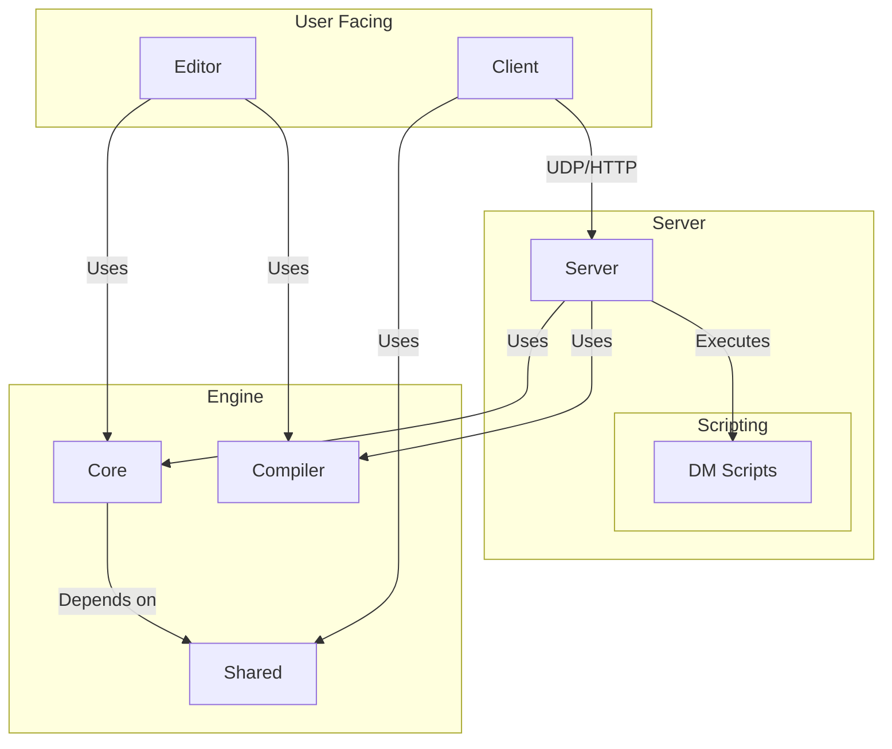

# Architecture

The BYOND 2.0 project is a game engine with a client-server architecture, built on .NET 8.0 using C# for the core.

## Project Structure

The solution is organized into several projects, each with a distinct responsibility:

*   **Shared:** This is the foundational class library. It contains the core data models, interfaces, and utilities that are shared across all other projects. This includes the `IGameObject` interface, the `GameState` class, and interfaces for key services like `IScriptManager` and `IObjectApi`.
*   **Core:** This library contains the main engine logic and concrete implementations of the interfaces defined in `Shared`. This includes the `GameObject` implementation, the `ScriptManager`, `ObjectApi`, and other core services. It is used by the `Server` and `Editor`.
*   **Server:** A console application that runs the game server. It is responsible for managing the game world, handling client connections, and executing scripts.
*   **Client:** A basic console application that serves as the game client. It handles user input and communicates with the server.
*   **Editor:** A graphical application built with Silk.NET and ImGui for creating and editing game maps, objects, and other resources.
*   **Compiler:** The OpenDream compiler, integrated as a project, which compiles DM scripts into a format the engine can understand.
*   **scripts:** A directory containing DM, Lua, and C# scripts that define the game logic.
*   **tests:** A project with unit tests to verify the correct operation of the project components.

## Key Architectural Concepts

### Game State Management
The entire state of the game world is managed by a central `GameState` object, which is accessed through the `IGameState` interface. This object holds all game objects, the map, and other world-level data. This centralized approach simplifies state synchronization and persistence.

### Networking
The server uses a dual-protocol approach:
1.  **UDP:** A custom UDP implementation is used for real-time, low-latency game events like player movement and actions.
2.  **HTTP:** The Kestrel web server is used to serve static game assets (e.g., textures, sounds) to clients on demand.

### Configuration
Server settings are managed through a `server_config.json` file. This allows operators to easily configure parameters like the server port and other runtime options without recompiling the code.

### Game Loop and Regional Processing
The server can run in two modes: a simple global loop that processes every object, or a high-performance mode that uses **Regional Processing** to only process areas of the world near players. This is a key feature for performance scaling in large worlds. For a detailed explanation, see the [Game Loop and Regional Processing](./regional-processing.md) document.

### Scripting and the Virtual Machine (VM)
The engine primarily uses **Dream Maker (DM)** for game logic. The OpenDream compiler transforms DM code into an intermediate bytecode. The server's Virtual Machine (VM) then executes this bytecode at runtime. This architecture decouples the game logic from the core engine, allowing for features like hot-reloading. For more in-depth information, see the [VM Internals](./vm_internals.md) document.

## Architecture Diagram

