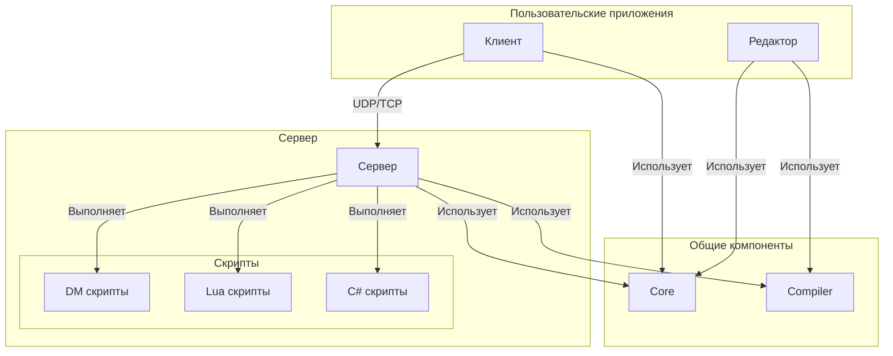

# Архитектура

Проект BYOND 2.0 представляет собой игровой движок с клиент-серверной архитектурой, построенный на .NET 8.0 с использованием C# для ядра.

## Скриптинг

В качестве основного языка для описания игровой логики движок использует **Dream Maker (DM)** — язык, применяемый в BYOND. Интегрированный компилятор OpenDream компилирует DM-код в промежуточный формат, который может исполнять виртуальная машина сервера.

Дополнительно поддерживаются **Lua** и **C#** для более специализированных задач, написания критичного к производительности кода или для разработчиков, которым удобнее работать с этими языками.

## Структура проекта

Проект разделен на несколько ключевых компонентов:

*   **Core:** Библиотека классов, содержащая основную логику и общие компоненты, которые используются сервером, клиентом и редактором. Это включает в себя управление состоянием игры, объектную модель и интерфейсы скриптового движка.
*   **Server:** Консольное приложение, которое запускает игровой сервер. Оно использует кастомную реализацию UDP для обмена данными в реальном времени и веб-сервер Kestrel для раздачи ассетов по HTTP. Сервер отвечает за управление игровым миром, обработку подключений клиентов и выполнение скриптов.
*   **Client:** Базовое консольное приложение, которое представляет собой игровой клиент. Оно обрабатывает пользовательский ввод и взаимодействует с сервером.
*   **Editor:** Графическое приложение, созданное с помощью Silk.NET и ImGui, для создания и редактирования игровых карт, объектов и других ресурсов.
*   **Compiler:** Компилятор OpenDream, интегрированный в виде проекта, который компилирует DM-скрипты в понятный для движка формат.
*   **scripts:** Каталог, содержащий скрипты на DM, Lua и C#, которые определяют игровую логику.
*   **tests:** Проект с модульными тестами для проверки корректности работы компонентов проекта.

## Диаграмма архитектуры

