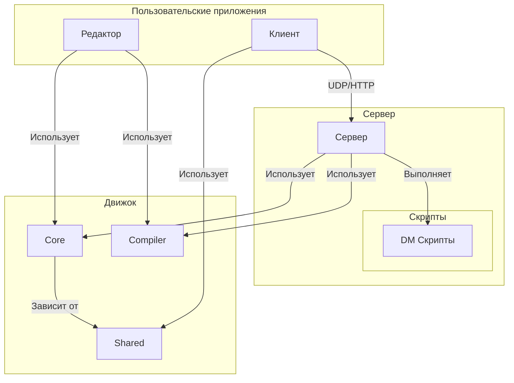

# Архитектура

Проект BYOND 2.0 представляет собой игровой движок с клиент-серверной архитектурой, построенный на .NET 8.0 с использованием C# для ядра.

## Структура проекта

Решение организовано в несколько проектов, каждый из которых имеет четко определенную зону ответственности:

*   **Shared:** Это фундаментальная библиотека классов. Она содержит основные модели данных, интерфейсы и утилиты, которые являются общими для всех остальных проектов. Сюда входят интерфейс `IGameObject`, класс `GameState`, а также интерфейсы для ключевых сервисов, таких как `IScriptManager` и `IObjectApi`.
*   **Core:** Эта библиотека содержит основную логику движка и конкретные реализации интерфейсов, определенных в `Shared`. Сюда входят реализация `GameObject`, `ScriptManager`, `ObjectApi` и другие основные сервисы. Используется `Server` и `Editor`.
*   **Server:** Консольное приложение, которое запускает игровой сервер. Оно отвечает за управление игровым миром, обработку подключений клиентов и выполнение скриптов.
*   **Client:** Базовое консольное приложение, которое представляет собой игровой клиент. Оно обрабатывает пользовательский ввод и взаимодействует с сервером.
*   **Editor:** Графическое приложение, созданное с помощью Silk.NET и ImGui, для создания и редактирования игровых карт, объектов и других ресурсов.
*   **Compiler:** Компилятор OpenDream, интегрированный в виде проекта, который компилирует DM-скрипты в понятный для движка формат.
*   **scripts:** Каталог, содержащий скрипты на DM, Lua и C#, которые определяют игровую логику.
*   **tests:** Проект с модульными тестами для проверки корректности работы компонентов проекта.

## Ключевые архитектурные концепции

### Управление состоянием игры
Все состояние игрового мира управляется центральным объектом `GameState`, доступ к которому осуществляется через интерфейс `IGameState`. Этот объект содержит все игровые объекты, карту и другие данные мирового уровня. Такой централизованный подход упрощает синхронизацию и сохранение состояния.

### Сетевое взаимодействие
Сервер использует двухпротокольный подход:
1.  **UDP:** Кастомная реализация UDP используется для передачи игровых событий в реальном времени с низкой задержкой, таких как движение игроков и их действия.
2.  **HTTP:** Веб-сервер Kestrel используется для раздачи клиентам статических игровых ассетов (например, текстур, звуков) по запросу.

### Конфигурация
Настройки сервера управляются через файл `server_config.json`. Это позволяет операторам легко настраивать такие параметры, как порт сервера и другие опции времени выполнения, без перекомпиляции кода.

### Игровой цикл и региональная обработка
Сервер может работать в двух режимах: в простом глобальном цикле, который обрабатывает каждый объект, или в высокопроизводительном режиме, который использует **региональную обработку** для обработки только тех областей мира, которые находятся рядом с игроками. Это ключевая функция для масштабирования производительности в больших мирах. Для подробного объяснения см. документ [Игровой цикл и региональная обработка](./regional-processing.md).

### Скриптинг и виртуальная машина (VM)
В качестве основного языка для игровой логики движок использует **Dream Maker (DM)**. Компилятор OpenDream преобразует DM-код в промежуточный байт-код. Затем виртуальная машина (VM) сервера выполняет этот байт-код во время выполнения. Эта архитектура отделяет игровую логику от ядра движка, что позволяет реализовать такие функции, как горячая перезагрузка. Для получения более подробной информации см. документ [Внутреннее устройство VM](./vm_internals.md).

## Диаграмма архитектуры

