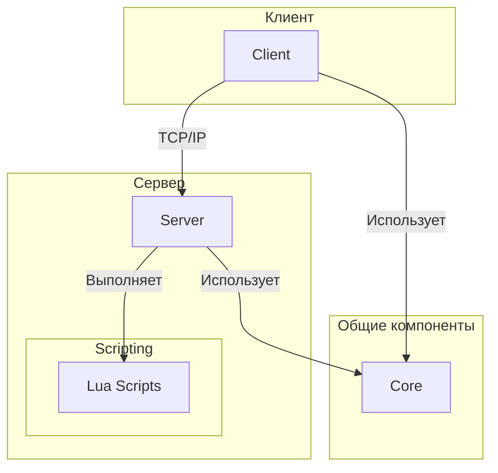

# Архитектура

Проект BYOND 2.0 представляет собой игровой движок с клиент-серверной архитектурой, построенный на .NET 8.0 с использованием C# и Lua для скриптинга.

## Структура проекта

Проект разделен на несколько ключевых компонентов:

*   **Core:** Библиотека классов, содержащая основную логику и общие компоненты, которые используются как сервером, так и клиентом. Это включает в себя игровую логику, управление состоянием и скриптовый движок.
*   **Server:** Консольное приложение, которое запускает игровой сервер. Он отвечает за управление игровым миром, обработку подключений клиентов и выполнение скриптов на Lua.
*   **Client:** Консольное приложение, которое представляет собой игровой клиент. Он отвечает за рендеринг игрового мира, обработку пользовательского ввода и взаимодействие с сервером.
*   **scripts:** Каталог, содержащий скрипты на Lua, которые определяют игровую логику.
*   **tests:** Проект с модульными тестами для проверки корректности работы компонентов проекта.

## Диаграмма архитектуры

